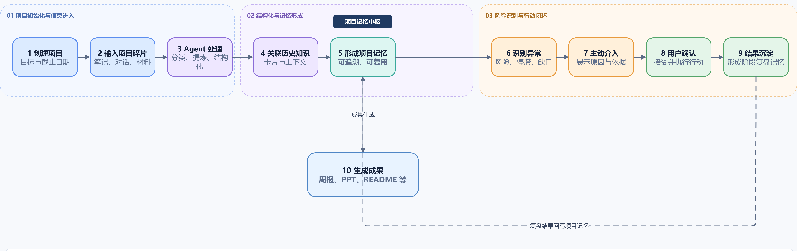
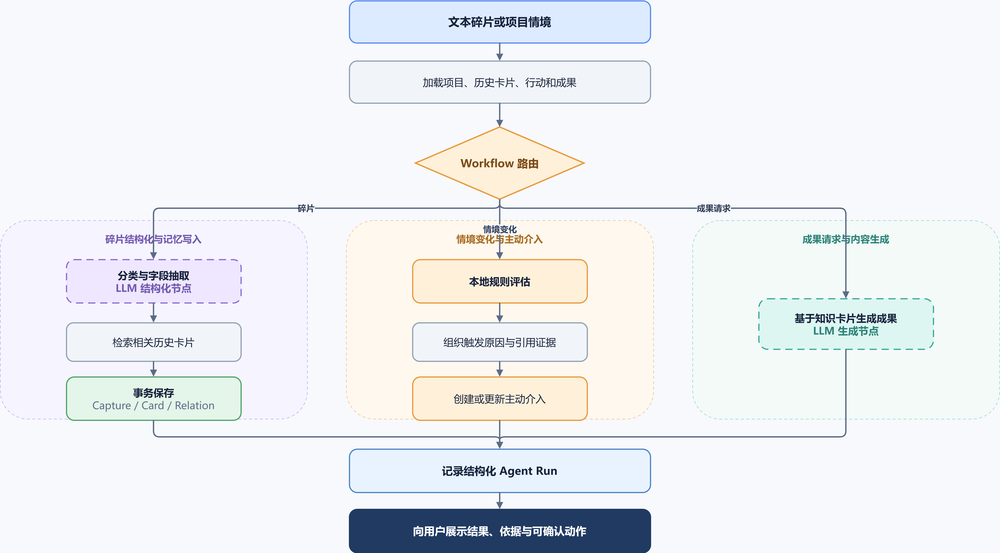
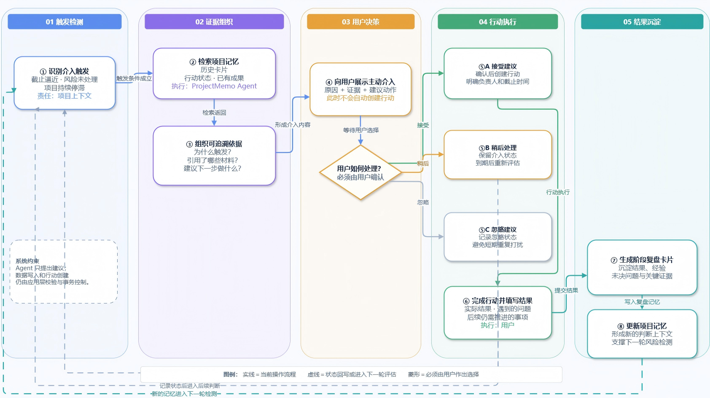
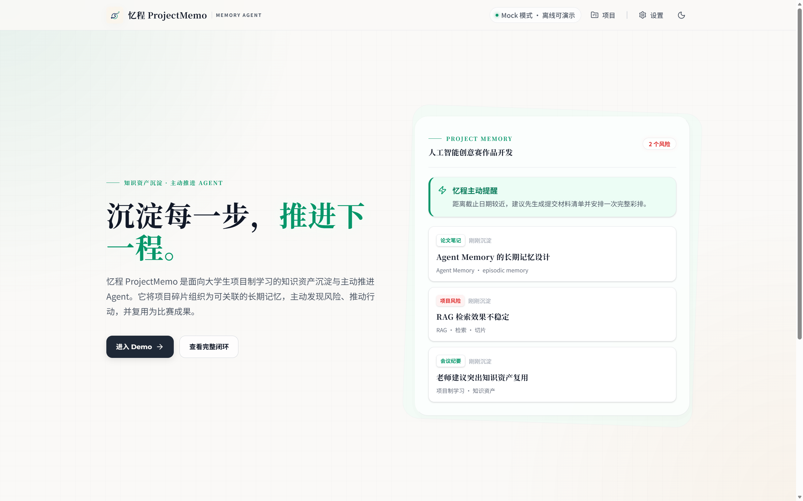
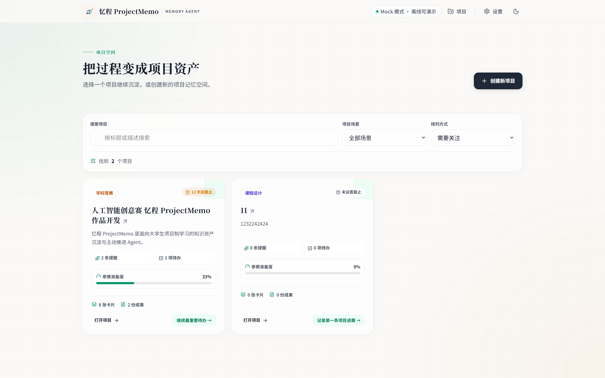
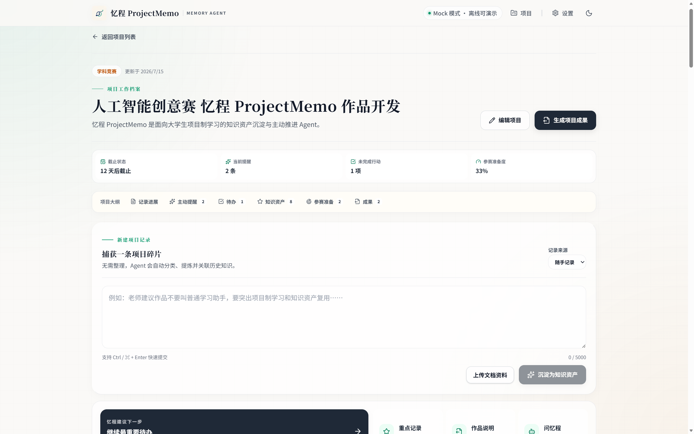
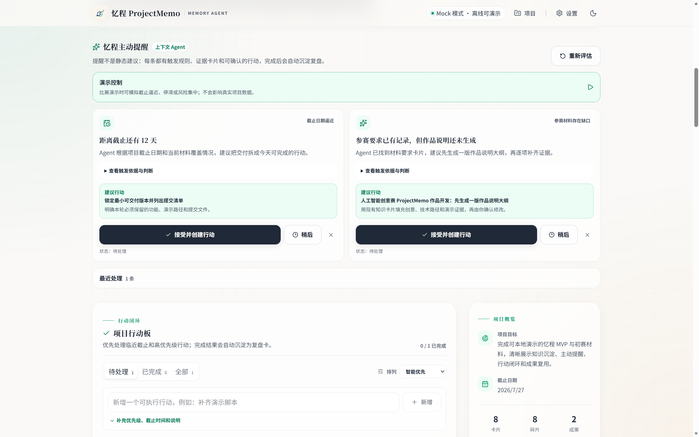
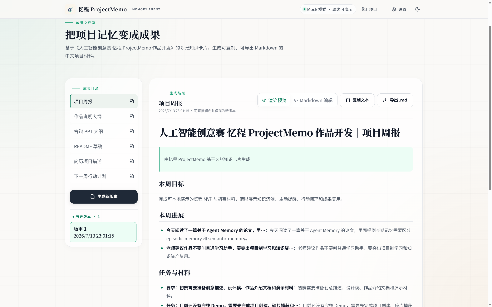

# 2026“中国高校计算机大赛—人工智能创意赛”

## 忆程 ProjectMemo｜鸿蒙赛道作品说明文档（初赛）Markdown 草案

> 作品名称：忆程 ProjectMemo  
> 参赛方向：Agent 创新  
> 文档状态：内容草案，尚未迁入官方 Word 模板  
> 更新日期：2026-07-15  
> 产品定位：面向大学生项目制学习的知识资产沉淀与主动推进 Agent  
> 重要说明：`【待填写】` 内容必须由参赛团队核实；所有“当前已实现”能力均须在最终冻结版本中逐项复现。

## 目录

1. [参赛团队信息](#1-参赛团队信息)
2. [作品原创性声明](#2-作品原创性声明)
3. [创意描述](#3-创意描述30字以内)
4. [设计稿（Agent 创新）](#4-设计稿agent-创新)
5. [作品介绍](#5-作品介绍800字以内)
6. [官方模板字段映射](#6-官方模板字段映射)
7. [迁移到正式模板的检查清单](#7-迁移到正式模板的检查清单)

## 1. 参赛团队信息

### 1.1 封面信息

| 字段 | 内容 | 填写要求 |
| --- | --- | --- |
| 参赛学校   |武汉大学         |  | 以队长学校为准，填写学校全称 |
| 团队名称 | 【待填写】 | 10个字符以内，中英文皆可，不使用标点符号 |
| 作品名称 | 忆程 ProjectMemo | 30个字符以内 |
| 赛题方向 | （　）应用创新　（√）Agent创新　（　）用户体验创新　（　）操作系统智能创新 | 最终 Word 中保留勾选 |
| 联系人（队长） | 【待填写】 | 与报名系统一致 |
| 联系电话（队长） | 【待填写】 | 与报名系统一致 |

### 1.2 参赛队员基本信息

> 可跨校、跨专业组队，队员总数不超过3人。无成员的位置在正式模板中删除，不保留虚构示例。

| 姓名 | 学校全称 | 院（系）全称 | 专业全称 | 年级 | 毕业时间 | 联系电话 | 邮箱 | 团队分工 |
| --- | --- | --- | --- | --- | --- | --- | --- | --- |
| 【队长待填写】 | 【待填写】 | 【待填写】 | 【待填写】 | 【待填写】 | 【待填写】 | 【待填写】 | 【待填写】 | 产品设计、Agent 与系统开发【待核实】 |
| 【队员待填写】 | 【待填写】 | 【待填写】 | 【待填写】 | 【待填写】 | 【待填写】 | 【待填写】 | 【待填写】 | 【待填写】 |
| 【队员待填写】 | 【待填写】 | 【待填写】 | 【待填写】 | 【待填写】 | 【待填写】 | 【待填写】 | 【待填写】 | 【待填写】 |

### 1.3 团队指导教师信息

> 指导教师须为队长所属学校的正式教师。

| 姓名 | 院（系）全称 | 职称 | 研究方向 | 联系电话 | 联系邮箱 |
| --- | --- | --- | --- | --- | --- |
| 【待填写】 | 【待填写】 | 【待填写】 | 【待填写】 | 【待填写】 | 【待填写】 |

### 1.4 团队成员优势描述

【待填写：建议用100–200字说明成员已有项目经历、产品/设计/算法/前端/后端能力及分工互补情况。不得虚构获奖、论文、专利、用户规模或上线经历。】

## 2. 作品原创性声明

郑重声明：本参赛队伍报名信息真实有效；呈交的参赛作品相关资料以及所完成的作品实物等相关成果，是本团队独立进行研究工作所取得的成果。除文中已经注明引用的内容外，本作品说明文档不包含其他个人或集体已经发表或撰写的作品成果，不侵犯任何第三方的知识产权或其他权利。本声明的法律结果由本参赛队承担。

参赛队员签名（团队全部成员）：

【待签名】

日期：2026年【待填写】月【待填写】日

指导老师审核签名：

【待签名】

日期：2026年【待填写】月【待填写】日

> 正式提交时可打印签名后扫描，或使用清晰的电子签名；声明页必须与作品说明文档合并为同一文件。

## 3. 创意描述（30字以内）

> **将项目碎片转化为会主动推动交付的长期记忆**

- 自动统计：20个汉字，不含 Markdown 加粗标记。
- 关键创新点：项目长期记忆、上下文主动介入、行动结果回写。

## 4. 设计稿（Agent 创新）

> 官方提交口径：初赛阶段“创意描述、设计稿、作品介绍文档”均为必选。本项目参加 Agent 创新方向，因此本章提供 Agent 交互流程图与当前界面效果图；“操作系统智能”方向要求的技术方案和测试报告不适用于本项目。

| 官方设计稿要求 | 本章对应材料 | 审核结论 |
| --- | --- | --- |
| 提供创意效果图，或交互流程图 | 图1目标用户流程、图2 Agent Workflow、图3主动介入闭环 | 已满足 |
| 展示创意的视觉设计 | 图4～图7当前可运行界面截图 | 已满足 |
| 展示交互逻辑 | 图1与图3展示输入、Agent判断、用户确认、行动和结果回写 | 已满足 |
| 鼓励 Agent 赛题输出宣传海报 | 已形成海报生成提示词，正式海报尚未生成 | 鼓励项，建议提交前补充 |

### 4.1 创意背景

大学生在课程设计、科研训练、学科竞赛和创新创业项目中，会不断产生论文笔记、实验结果、代码报错、会议纪要、老师反馈和材料要求。这些信息通常散落在聊天记录、文档和个人笔记中，难以持续关联。临近截止日期时，学生仍需重新整理进展、风险和提交材料。

通用 AI 问答可以在一次对话中生成内容，但往往缺乏长期项目上下文，也无法说明提醒来自哪条历史记录，更难把建议推进为可验收的行动。忆程 ProjectMemo 以项目制学习为边界，重点解决“过程没有沉淀、经验难以复用、风险发现太晚、成果整理重复”四个问题。

### 4.2 用户与使用场景

核心用户为参与课程设计、科研训练和学科竞赛的大学生个人或小型团队。典型场景包括：

1. 阅读论文后随手记录关键方法，系统关联既有实验与方案。
2. 遇到代码报错或实验波动时，系统沉淀问题、风险和验证动作。
3. 会议或老师反馈后，系统提取要求与下一步任务。
4. 截止日期逼近或项目停滞时，Agent 主动提醒并给出证据。
5. 准备阶段汇报和比赛材料时，系统从真实项目记忆生成成果初稿。

### 4.3 用户流程设计

**图1　忆程 ProjectMemo 目标用户流程（当前实现与交互目标）**

### 4.4 Agent Workflow

**图2　忆程 ProjectMemo Agent Workflow（当前实现）**

Workflow 中，LLM 只是结构化或生成节点，不直接控制数据写入。项目隔离、输入校验、规则判断、工具白名单和数据库事务由应用层负责；模型失败时回退确定性 mock，保证现场演示不被网络或密钥阻断。

### 4.5 主动介入与行动闭环

**图3　主动介入—行动—反馈—记忆闭环（当前实现）**

图中“负责人”表示未来团队协作扩展位。当前单用户 Demo 已实现行动标题、说明、优先级、截止日期与完成回执，但未保存负责人字段；正式提交口径不将负责人分配描述为当前能力。

### 4.6 功能状态边界

| 能力 | 当前状态 | 说明 |
| --- | --- | --- |
| 项目创建、编辑、搜索和删除 | 当前已实现 | 可在本地 Demo 直接演示 |
| 碎片自动分类与结构化卡片 | 当前已实现 | 支持 mock 和 OpenAI-compatible 模型 |
| 历史知识关联、原文追溯、人工纠错 | 当前已实现 | 关系可双向查看 |
| 风险、任务、实验缺口和截止日期提醒 | 当前已实现 | 当前为页面内确定性规则提醒 |
| 六类成果生成、Markdown 渲染/编辑和版本留存 | 当前已实现 | 支持离线生成、草稿预览与 Markdown 导出 |
| 持久化主动介入、接受/稍后/忽略 | 当前已实现 | 项目页可操作并持久化状态 |
| 行动项与完成结果回写记忆 | 当前已实现 | 完成回执会生成 reflection 卡并关闭提醒 |
| 决策依据、运行记录和效果面板 | 当前已实现 | 展示结构化依据，不展示模型思维链 |
| 带引用的记忆副驾驶 | 当前已实现 | mock 离线可用，写工具执行前必须确认 |
| 小艺 Workflow 接入 | 后续接口预留 | 当前未接入，不提供测试态 Agent |
| 语音、图片和鸿蒙通知 | 后续路线 | 当前不进入功能清单 |

### 4.7 当前技术实现

- **前端与服务端**：Next.js 16 App Router、React 19、TypeScript、Tailwind CSS。
- **数据层**：Prisma 7、SQLite、自定义 Client 输出和 Repository 层。
- **Agent**：独立 Capture Pipeline、确定性 mock、OpenAI-compatible 可选 Provider、严格 JSON 校验与失败回退。
- **记忆检索**：`VectorStore` 抽象；当前按关键词交集计分，保留最多3张相关卡片。
- **主动提醒**：风险、任务/复盘、论文/实验和截止日期规则。
- **成果生成**：项目周报、作品说明、答辩 PPT、README、简历描述和下周行动计划；预览使用 GFM 渲染，源码编辑可在保存前切换查看草稿效果。
- **质量保障**：Zod、Vitest、SQLite 集成测试和 Playwright 核心流程。

### 4.8 主动 Agent 闭环实现

- 新增 `AgentIntervention` 保存主动介入及状态，使用项目内去重键防止重复提醒。
- 新增 `ActionItem` 保存行动、截止时间和完成结果；完成结果通过 Agent Pipeline 生成 `reflection` 卡片。
- 新增 `AgentRun` 保存规则命中、引用卡片、执行步骤、provider 和回退状态。
- 新增 `AgentMessage` 保存项目级副驾驶消息、引用和待确认工具。
- 上下文事件引擎在项目访问及数据变更后运行；当前版本不声称具备操作系统级后台推送。
- 演示情境明确保存模拟标记，并从真实效果指标中排除。
- 小艺方向采用 Workflow 工具预留：记忆捕获、记忆检索、获取提醒、创建行动和生成成果；当前不声称已发布。

### 4.9 用户体验设计原则

1. 主动但不越权：Agent 可发现和建议，写操作必须确认。
2. 依据可追溯：介入和回答都能定位项目卡片或明确规则。
3. 失败可恢复：草稿、用户输入和原有状态不会因模型失败丢失。
4. 状态可理解：加载、成功、失败、稍后、忽略和完成均有明确反馈。
5. 移动端优先级清晰：提醒 → 捕获 → 行动 → 知识资产 → 项目信息。
6. 演示口径诚实：模拟能力、目标设计与已实现能力具有明显标签。

### 4.10 当前可运行界面示例（2026-07-15）

以下图片均截自本地可运行的离线 mock 演示环境，使用 seed 项目“人工智能创意赛 忆程 ProjectMemo 作品开发”。图片中的项目记录、提醒和成果为演示数据；不包含真实用户、团队成员或联系方式。正式材料建议将图4～图8作为三张交互流程图的视觉效果佐证，并在图片下保留“本地 Demo 截图”说明。

**图4　产品价值主张与闭环入口（本地 Demo 截图）**

**图5　项目空间与参赛项目状态（本地 Demo 截图）**

**图6　项目工作台与记录入口（本地 Demo 截图）**

**图7　主动介入、证据说明与确认行动（本地 Demo 截图）**

**图8　从项目记忆生成并编辑成果（本地 Demo 截图）**

截图使用建议：

- 图4用于封面后的产品概览或视频开场；
- 图5用于说明多项目状态、筛选与“需要关注”排序；
- 图6用于说明“项目状态—记录—资产”的主工作台；
- 图7用于佐证 Agent 的主动性、依据可见与用户确认边界；
- 图8用于佐证记忆复用为交付材料，而非普通笔记存储。

图片源文件与使用说明见 [`assets/README.md`](assets/README.md)。

## 5. 作品介绍（800字以内）

> 统计范围：下方 `INTRO_START` 与 `INTRO_END` 之间的四段正文；自动统计值见正文之后。

<!-- INTRO_START -->
大学生在课程设计、科研训练和学科竞赛中，会持续产生论文笔记、实验结果、代码问题、会议结论和材料要求。这些信息散落在聊天、文档和个人笔记里，项目越久，越难回答“为何这样决定、风险是否处理、下一步做什么”。临近截止时，团队往往重新翻找记录、整理进展、拼装材料。通用问答助手擅长一次性生成，却缺少稳定的项目记忆、可追溯依据和持续推进机制。

忆程 ProjectMemo 将 AI 从“被动回答”转变为“主动推动交付”的项目记忆 Agent。用户输入自然语言碎片后，系统提取摘要、关键词、任务、重要性和下一步，关联历史卡片并保留原文；再根据截止逼近、风险未处理、项目停滞、实验或材料缺口主动介入。提醒展示触发原因与引用证据，用户可接受、稍后或忽略；接受后生成行动项，完成结果自动沉淀为复盘卡片，形成“记录—关联—判断—行动—反馈—记忆”闭环。

当前已完成可本地运行、完全离线演示的 Web Demo，支持碎片结构化、知识关联、行动板、主动提醒、带引用的记忆副驾驶和效果指标，并能生成周报、作品说明、答辩 PPT、README、简历描述和行动计划。成果支持 Markdown 渲染与编辑、复制、导出和版本留存。系统采用 Next.js、TypeScript、Prisma 与 SQLite；模型通过 OpenAI-compatible 接口接入，结构化结果需严格校验，超时、非法 JSON 或无密钥时自动回退确定性 Mock，保证演示稳定。

忆程 ProjectMemo 的创新不在于增加一个笔记库，而在于让项目记忆成为可解释、可确认、可回写的主动服务。它帮助学生保留决策脉络，把过程材料转化为可复用知识资产和交付成果。后续可扩展语音、图片、后台提醒与团队协作，并将核心工具封装为小艺 Workflow；当前仅保留接口设计，不宣称已接入。
<!-- INTRO_END -->

- 自动统计：`761` 个字符（移除段落空白，不移除中英文标点和英文字符）。
- 目标范围：650–750个字符；官方上限为800字。

## 6. 官方模板字段映射

| 官方模板位置 | 本草案对应章节 | 当前状态 | 迁移要求 |
| --- | --- | --- | --- |
| 封面 | 1.1 封面信息 | 部分待填 | 补齐学校、团队、队长和电话 |
| 参赛团队信息表 | 1.2–1.4 | 待填 | 删除无成员示例行，核实分工 |
| 作品原创性声明 | 第2章 | 待签名 | 所有队员及指导教师签名 |
| 创意描述 | 第3章 | 内容已拟 | 保持30字以内 |
| 设计稿（Agent 创新） | 第4章 | 图稿与界面证据已完成 | 迁入官方模板时核对图1～图8清晰度与连续编号 |
| 介绍文档 | 第5章 | 内容已同步 | 最终冻结前复核功能口径，保持800字以内 |
| 格式与提交规范 | 第7章检查清单 | 待执行 | 迁入模板、排版、导出 PDF |

## 7. 迁移到正式模板的检查清单

### 7.1 信息与真实性

- [ ] 学校、团队名称、队员、联系方式与报名系统完全一致。
- [ ] 指导教师与队长同校且为正式教师。
- [ ] 团队分工和优势描述均由成员确认。
- [ ] 原创声明由全部队员和指导教师签名。
- [ ] 不虚构论文、专利、奖项、用户数量、效率提升或上线状态。

### 7.2 功能状态

- [ ] 每项“当前已实现”能力均能在最终冻结版本中复现。
- [ ] 不能在最终冻结版本中复现的能力，从提交稿删除或明确标注为后续路线。
- [ ] 小艺只写为 Workflow 接口预留，除非后续确实完成测试态 Agent。
- [ ] 演示情境在设计图、界面和视频中均标记为模拟。

### 7.3 字数与版式

- [ ] 作品名称不超过30个字符。
- [ ] 团队名称不超过10个字符且无标点。
- [ ] 创意描述不超过30字。
- [ ] 作品介绍不超过800字。
- [ ] 正文使用官方要求的字体、字号和单倍行距。
- [ ] A4纵向，上下页边距2.5厘米、左右3厘米。
- [ ] 页面底端外侧插入页码。
- [ ] 所有图片和表格按序编号并命名。
- [ ] 图1～图3在 Word/PDF 页面宽度下文字仍清晰可读，必要时单图独占一页。
- [ ] 宣传海报属于 Agent 方向鼓励项；若正式生成，放在设计稿开头，但不以提示词代替成品海报。
- [ ] 主体内容不超过20页。

### 7.4 文件与提交

- [ ] 最终 PDF 命名为 `01-作品说明文档+参赛队伍名称.pdf`。
- [ ] 若提交演示视频，时长不超过5分钟，命名符合赛事要求。
- [ ] 源代码或演示系统压缩包包含运行所需工程文件和说明。
- [ ] 提交前再次核对官网、赛事群或官方通知中的截止时间和材料要求。

---

本草案依据本地官方通知、官方初赛 Word 模板和忆程 ProjectMemo 当前可运行仓库形成。当前赛程暂按 **2026-07-26 24:00** 为初赛报名/作品提交截止；如官方渠道更新，以最新通知为准。
