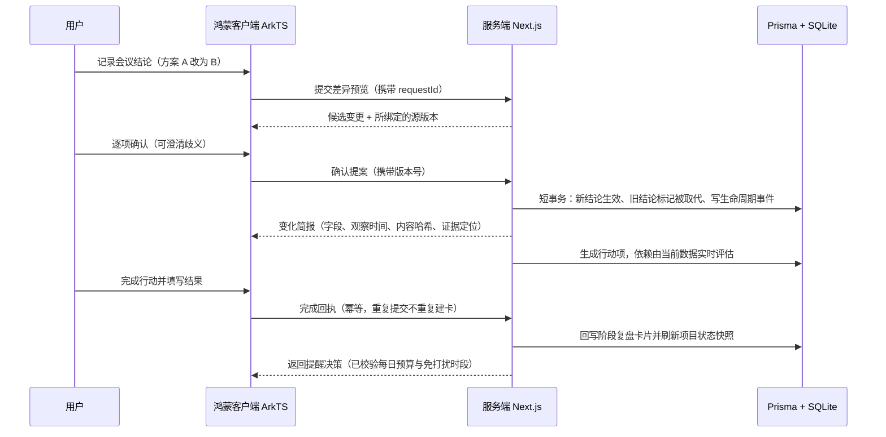
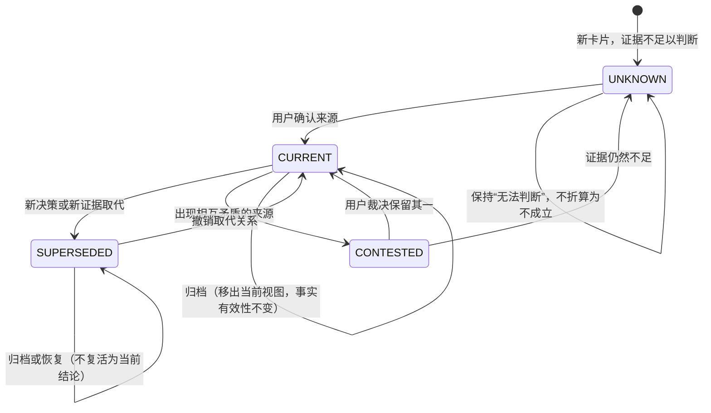
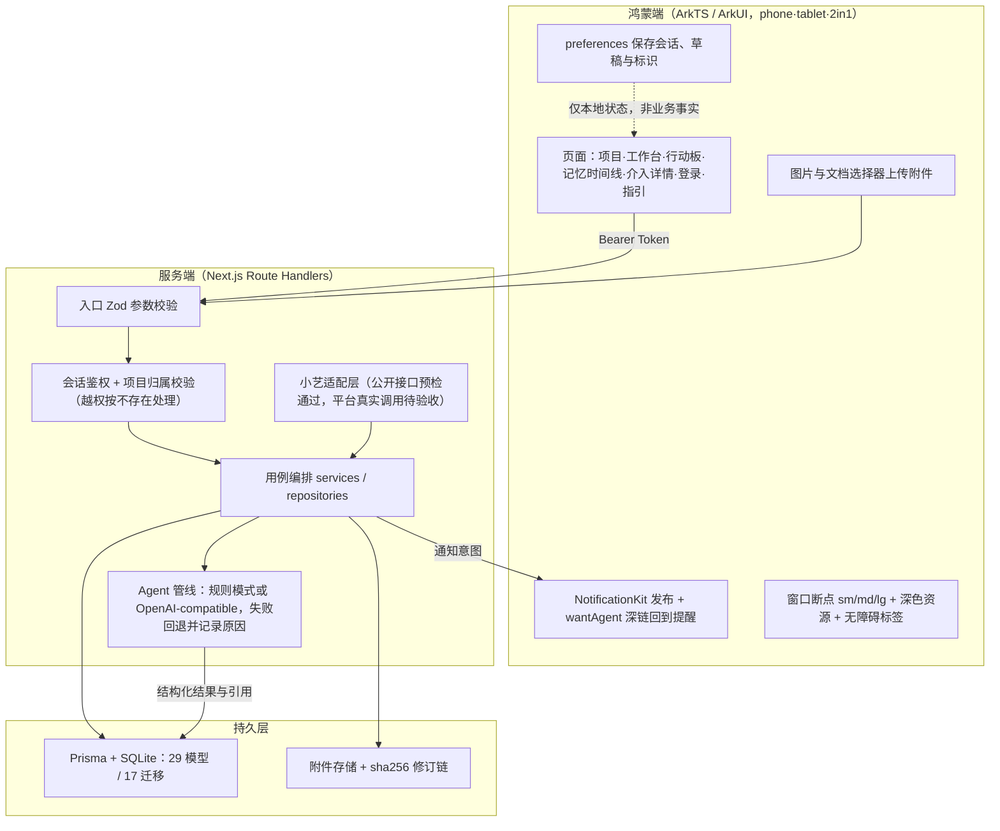
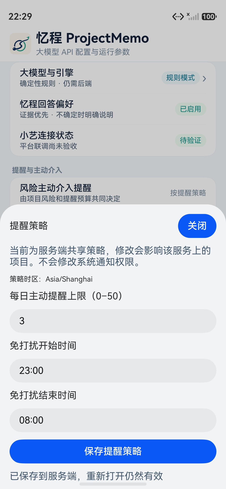
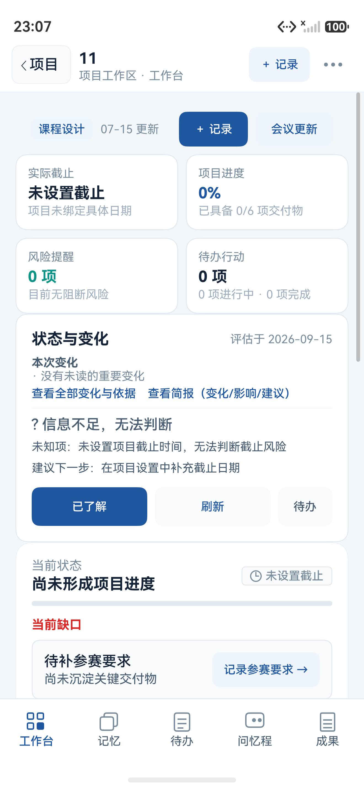
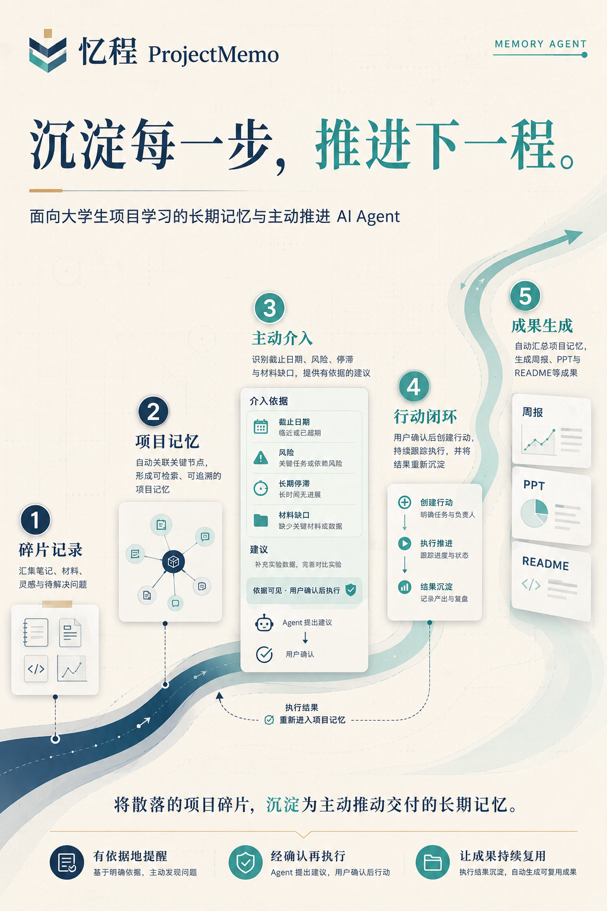

# 2026 中国高校计算机大赛—人工智能创意赛

## 忆程 ProjectMemo｜鸿蒙赛道复赛作品说明文档草案

> 作品名称：忆程 ProjectMemo
> 团队名称：万卷 siu
> 参赛方向：Agent 创新
> 文档状态：正式正文与内部核验区已分开，尚未迁入官方 Word 模板
> 更新日期：2026-09-16
> 依据：官方复赛 Word 模板、初赛提交版 `01-作品说明文档+万卷siu.pdf`、当前工作区源码与 `evidence/` 回执
> 重要说明：第 1～5 章为正式提交正文候选，第 6～9 章仅供团队核验，迁入官方模板时删除。`【待确认】` 须由参赛团队核实；标注“待绘制/待重拍”的图片不得以文字描述冒充成品。

## 目录

1. [参赛团队信息](#1-参赛团队信息)
2. [作品原创性声明](#2-作品原创性声明)
3. [创意描述（100 字以内）](#3-创意描述100-字以内)
4. [设计稿（Agent 创新）](#4-设计稿agent-创新)
5. [介绍文档（1500 字以内）](#5-介绍文档1500-字以内)
6. [复赛相对初赛的变化与口径修正](#6-复赛相对初赛的变化与口径修正内部说明不进入正式提交稿)
7. [官方模板字段映射](#7-官方模板字段映射)
8. [迁移与提交前检查清单](#8-迁移与提交前检查清单)
9. [附录：证据索引与待填信息](#9-附录证据索引与待填信息)

---

## 封面信息（官方模板首页逐项填写）

| 模板字段 | 填写内容 |
| --- | --- |
| 参赛学校 | 武汉大学 |
| 团队名称 | 万卷 siu |
| 作品名称 | 忆程 ProjectMemo |
| 赛题方向 | （　）应用创新　（√）Agent 创新　（　）用户体验创新　（　）操作系统智能创新 |
| 联系人（队长） | 肖圣鑫 |
| 联系电话（队长） | 13680290292 |

> 复赛模板的三项硬性口径与初赛不同：**创意描述上限 100 字**（初赛 30 字）、**介绍文档上限 1500 字**（初赛 800 字）、介绍文档明确要求包含**市场前景评估**。其余版式与页数要求不变。

---

## 1. 参赛团队信息

### 1.1 参赛队员基本信息

> 可跨校、跨专业组队，队员总数不超过 3 人。无成员的位置在正式模板中删除，不保留虚构示例。

| 姓名 | 学校全称 | 院（系）全称 | 专业全称 | 年级 | 毕业时间 | 联系电话 | 邮箱 | 团队分工 |
| --- | --- | --- | --- | --- | --- | --- | --- | --- |
| 肖圣鑫 | 武汉大学 | 数学与统计学院 | 信息与计算科学 | 大二 | 2028.6 | 13680290292 | sxshaw593730@163.com | 队长，产品设计、Agent 与全栈开发 |
| 【如有新增队员待确认】 | | | | | | | | |

### 1.2 团队指导教师信息

> 指导教师须为队长所属学校的正式教师。

| 姓名 | 院（系）全称 | 职称 | 研究方向 | 联系电话 | 联系邮箱 |
| --- | --- | --- | --- | --- | --- |
| 吕锡亮 | 数学与统计学院 | 教授 | 反问题 | 18971606583 | xllv.math@whu.edu.cn |

### 1.3 团队成员优势描述

本团队为单人成队。成员来自武汉大学信息与计算科学专业，数学训练使其能够把模糊的项目困境抽象为状态、证据与约束；机器学习、数据结构和智能体系统方面的持续学习，则为方案落地提供了技术基础。

成员曾参与基于 MinerU 2.5 与 Qwen2.5-VL 的多模态文档解析实践，承担环境配置、批量数据处理、模型测试与性能优化，并积累了 AI 智能助教、知识库应用和 Agent Workflow 设计经验。上述经历让本项目从一开始就关注三个问题：模型输出能否追溯，失败后能否恢复，智能体是否把最终决定留给用户。

在忆程 ProjectMemo 中，成员独立完成需求分析、产品设计、Agent 工作流、Web 与鸿蒙 ArkTS 双端开发、数据迁移、测试回归和参赛材料制作。单人开发并不意味着省略工程分工，而是以统一的产品判断贯穿“发现问题—建立证据—实现闭环—验证边界”的全过程。

## 2. 作品原创性声明

郑重声明：承诺本参赛队伍报名信息真实有效；呈交的参赛作品相关资料以及所完成的作品实物等相关成果，是本团队独立进行研究工作所取得的成果，除文中已经注明引用的内容外，本作品说明文档不包含任何其他个人或集体已经发表或撰写过的作品成果，不侵犯任何第三方的知识产权或其他权利。本声明的法律结果由本参赛队承担。

参赛队员签名（团队全部成员）：

【待签名】

日期：2026 年【待确认】月【待确认】日

指导老师审核签名：

【待签名】

日期：2026 年【待确认】月【待确认】日

> 复赛须重新签署声明页并与作品说明正文合并为同一 PDF，否则提交可能无效。

## 3. 创意描述（100 字以内）

> **忆程 ProjectMemo 将会议、实验、代码与材料沉淀为可追溯的项目记忆，识别方案变化与临期风险，经用户确认转化为行动，再把执行结果回写为新证据，让项目始终记得为何改变、下一步该做什么。**

- 统计：当前为 93 个字符（去除空白后的全部字符），低于官方上限 100 字。
- 关键创新点：证据可追溯、时态可判断、介入可确认、结果可回写、鸿蒙端与后端协同。

## 4. 设计稿（Agent 创新）

> 官方口径：Agent 创新方向需提供创意效果图或交互流程图，展示视觉设计与交互逻辑，鼓励输出宣传海报。“操作系统智能”方向要求的技术方案与测试报告不适用于本项目。

| 官方设计稿要求 | 本章对应材料 | 审核结论 |
| --- | --- | --- |
| 提供创意效果图，或交互流程图 | 图 1～图 6 流程、状态与架构图 | 材料已备；图 4～图 6 待导出为高清图片 |
| 展示创意的视觉设计 | 图 7～图 10 鸿蒙客户端截图、图 11～图 13 Web 端截图 | 材料已备；图 10 待用最终包重拍 |
| 展示交互逻辑 | 图 1 主流程、图 3 介入闭环、图 9 工作台与简报入口 | 材料已备；迁入模板后复核图文顺序 |
| Agent 方向鼓励输出宣传海报 | 图 14 宣传海报 | 初稿已备；文案待按复赛主线更新 |

### 4.1 设计概述

忆程 ProjectMemo 是一份会随项目一同生长的“过程档案与决策手账”，面向大学生课程设计、科研训练和学科竞赛。它不只收藏论文笔记、实验结果、代码问题与会议结论，还记录这些信息何时有效、为何改变、影响了什么。风险临近时，系统给出带依据的提醒；只有经过用户确认，建议才会转化为行动；行动完成后，结果又回到记忆中，成为下一次判断的证据。

复赛主线固定为一条可完整演示的链路：

> 一次会议改变方案 → 系统展示变化与影响 → 用户逐项确认 → 旧方案退出当前结论 → 下一步行动暴露依赖 → 用户完成行动 → 结果成为新证据 → 项目状态随之更新

初赛以 Web 演示为主；复赛进一步把这条主线落到**鸿蒙 ArkTS 客户端与账号隔离的后端**上，并把“系统为何这样判断”从一句产品承诺，变成可点击、可追溯、可复核的交互契约。

### 4.2 交互流程与架构

**图 1　目标用户流程（当前实现与交互目标）**

用户从项目碎片输入开始，经过结构化、历史关联和风险识别，完成用户确认、行动回写与成果生成。

**图 2　Agent Workflow（当前实现）**

模型只承担结构化与内容生成节点；项目隔离、输入校验、规则判断、工具白名单和数据库事务由应用层负责。模型超时、返回非法 JSON 或无密钥时回退确定性 Mock，并在运行记录中保留 `provider` 与 `fallbackReason`。

**图 3　主动介入—行动—反馈—记忆闭环（当前实现）**

Agent 先识别触发情境，再组织引用证据与建议行动；接受、稍后或忽略均由用户决定。当前单用户 Demo 已实现行动标题、说明、优先级、截止日期与完成回执；图中“负责人”为后续团队协作扩展位，不作为当前能力宣称。

**图 4　复赛主线时序：会议变更到结果回写**

确认与业务写入在同一事务内提交，模型调用置于事务之外；过期提案不能覆盖较新的修改，阅读简报本身不会产生行动。

**图 5　记忆时态生命周期与状态流转**

每个状态都保留原因码与证据引用；人工确认只表示用户确认了来源声明，不表示客观事实已被系统证明；恢复归档不会让已取代的结论重新变为当前结论。

**图 6　端云分层与数据流**

端侧只承担展示、输入与系统通知；业务事实、幂等键、权限判定与审计全部在服务端。规则模式只是不依赖模型密钥，仍需要后端，手机不是完全离线可用。

### 4.3 当前可运行界面

以下截图来自本地可运行的开发环境（确定性规则模式 + 独立 SQLite），项目内容为演示数据，不含真实用户资料与联系方式。鸿蒙截图为 DevEco 模拟器（Pura 90 镜像，1320×2856，HarmonyOS 6.1.0.126），**真机安装与显示效果尚未验收**，正式提交前需在最终交付包上重拍。

**图 7　提醒策略与能力边界设置（鸿蒙客户端）**

同一屏集中呈现产品的能力边界：引擎标注“确定性规则 · 仍需后端”，小艺标注“平台联调尚未验收 · 待验证”，提醒策略按当前登录用户隔离，并明确它不等同于系统通知权限。保存成功后，页面提示“已保存到服务端，重新打开仍然有效”。

**图 8　项目空间与会话恢复（鸿蒙客户端）**

已登录会话冷启动后直接恢复项目列表；空项目展示“下一步：记录第一条项目进展”，不把未评估状态显示成假的 0%。

**图 9　项目工作台与状态变化（鸿蒙客户端）**

工作台顶部集中展示截止、进度、风险与待办；“状态与变化”提供变化摘要与可点击的证据入口；证据不足时明确输出“信息不足，无法判断”并给出下一步建议，而不是编造结论。底部为工作台 / 记忆 / 待办 / 问忆程 / 成果五个页签。

**图 10　跨项目记忆检索（鸿蒙客户端，待重拍）**

当前截图为空态，正式稿需换成含卡片与状态标签的画面。

**图 11　项目空间与参赛项目状态（Web 端）**

**图 12　主动介入、证据说明与确认行动（Web 端）**

**图 13　从项目记忆生成并编辑成果（Web 端）**

**图 14　宣传海报（Agent 方向鼓励项）**

海报文案停留在初赛口径，建议按复赛主线（会议改变方案 → 证据简报 → 确认 → 行动 → 回写）更新后重新导出。

截图使用建议：图 7～图 9 为复赛新增且最能证明鸿蒙赛道适配的材料，应放在设计稿靠前位置；Web 截图可压缩到两张，用于说明工作台与成果生成，避免页数超限。

### 4.4 功能状态边界

分三档陈述，避免把“代码已实现”说成“设备已验收”。

**A. 当前已实现，并有源码或自动化回归依据**

| 能力 | 实现位置 |
| --- | --- |
| 账号登录、会话恢复与项目归属隔离 | `lib/auth/`、`app/api/auth/`、`harmonyos/.../LoginPage.ets`、`LoginView.ets`、`SessionStore.ets` |
| 项目创建、编辑、搜索、场景筛选与总览 | `app/projects/`、`Index.ets`、`ProjectService.ets` |
| 文本碎片记录、请求 ID 幂等与草稿恢复 | `Capture` + `@@unique([projectId,requestId])`、`ProjectHome.ets` |
| 图片/PDF 附件上传、文本提取与人工纠错修订链 | `attachmentService.ts`、`AttachmentRevision`、`AttachmentService.ets` |
| 碎片结构化、关键词与元数据检索、相关卡片关联 | `lib/agent/`、`lib/memory/hybridSearch.ts`、`linker.ts` |
| 记忆时态状态统一展示（四态 + 原因 + 证据） | `lib/memory/temporalLedger.ts`、`MemoryTimeline.ets` |
| 项目状态快照、差异、新鲜度与变化简报 | `lib/projectState/`、`projectStateService.ts`、`projectChangeBriefService.ts` |
| 会议更新预览、逐项确认与并发冲突保护 | `meetingStateDiffService.ts`、`MeetingImportSheet.ets` |
| 行动依赖可行性评估与解阻解释 | `actionFeasibilityService.ts`、`ActionBoard.ets` |
| 主动介入触发、接受/稍后/忽略、完成回写复盘卡 | `agentContextService.ts`、`InterventionDetail.ets` |
| 提醒预算、免打扰时段、按用户隔离的策略、项目级偏好与送达回执 | `interventionPolicyService.ts`、`ReminderSettingsView.ets` |
| 带引用的记忆副驾驶，写操作需确认 | `copilotService.ts`、`AgentMessage` |
| 六类成果生成、逐句来源引用与声明审计 | `artifactService.ts`、`artifactAuditService.ts`、`ClaimAuditorDrawer.ets` |
| 证据可信回执（依据充分/存在冲突/证据不足） | `lib/evidence/trustReceipt.ts` |
| 鸿蒙通知发布与深链、断点布局、深色资源、无障碍标签的代码实现 | `NotificationService.ets`、`WindowMetrics.ets`、`resources/dark` |

**B. 代码与服务端回归已验证，设备或平台验收尚未完成**

- 鸿蒙主线交互：长文本录入、键盘弹出、大字号、断网恢复、杀进程与重启后的持久化，仍需在真机与最终签名包上验收。
- 原生通知的实际曝光：`InterventionDelivery.PUBLISHED` 只表示系统接口接受发布，不等于用户已看到。
- 提醒“稍后”：工作台延期已实现；系统级定时代理尚未接入时会明确提示，不能宣称离开应用后必然按时唤起。
- 桌面卡片：Form 扩展能力与 `WidgetCard.ets` 已建，当前展示示例数据，未接真实项目状态。
- 平板与折叠屏适配：仅有 `sm/md/lg` 断点代码依据，未在宽屏设备验证，不扩大兼容声明。
- 当前代码回归：截至 2026-09-16，全量单元/集成测试 37 文件、270 例通过，TypeScript 检查与 Web 生产构建通过，鸿蒙检查 39/39 通过；评审 flavor 已指向公网 HTTPS，unsigned HAP 构建成功。最近一次 E2E 记录为 9/9，通过后尚未针对最新修复重跑。
- 交付状态：ECS 公网登录与项目状态接口已验证，DevEco 模拟器完成评审账号主流程；DeepSeek 官方接口返回 HTTP 200。HAP 仍未配置正式签名，真机安装、小艺平台真实调用与最终封包尚未验收；以上结果不能替代最终签名产物的干净安装与重启验收。
- 小艺状态：公开后端路由预检已通过，但尚未从小艺开放平台测试态完成真实调用、ID 对账与多轮稳定性验收。

**C. 后续路线，当前不进入功能清单**

- 应用内排程建议、GitHub/Calendar 只读同步、后台任务与自动整理。
- 多人协作与负责人分配、语音与拍照输入、完全离线端侧推理。

### 4.5 体验与可信性设计原则

1. 主动但不越权：Agent 可发现、可建议，写操作必须经用户确认。
2. 依据可追溯：介入、简报和回答都能定位到具体卡片、附件修订或明确规则。
3. 不确定就说不确定：证据不足时输出“无法判断”和下一步建议，不把 Unknown 当作 False。
4. 失败可恢复：草稿、原文与既有状态不因模型或网络失败丢失；刷新失败保留旧快照并标注过期。
5. 状态可理解：加载、成功、失败、稍后、忽略、完成、已归档与恢复均有明确反馈。
6. 打扰可控：提醒有预算、有静默时段、可撤销降频，曝光与忽略分开记账。
7. 口径诚实：规则模式、真实模型、Mock 回退、模拟器验证与真机验收使用不同标签，不混用。

## 5. 介绍文档（1500 字以内）

> 官方要求：具体描述创意的内容和实现路径，包含创意背景（行业痛点与用户需求分析）、核心功能设计（交互逻辑与技术实现路径）及市场前景评估。

<!-- INTRO_START -->
### 一、创意背景与需求分析

项目真正容易丢失的，往往不是一份文件，而是一项决定为何发生、一个风险是否处理、一条结论如今是否仍然有效。大学生在课程设计、科研训练和学科竞赛中不断产生论文笔记、实验结果、代码报错、会议结论与材料要求；它们散落在聊天、文档和个人笔记里，项目越长，越难回答“当初为什么这样决定”“旧方案是否已经失效”“下一步最该做什么”。临近截止，成员只能重新翻找记录、核对版本、拼装材料。笔记工具善于保存，待办工具善于列举，通用助手善于一次性生成，却很少持续维护项目事实的来路、时态与行动后果。忆程 ProjectMemo 正是从队长在课设、科研训练和竞赛备赛中的真实困扰出发；现阶段尚未开展规模化用户验证，不以虚构数据证明需求。

### 二、核心功能与技术实现路径

忆程以“记忆—状态—介入—行动—回写”为主线。**记录**：用户从鸿蒙端输入文字，或选择图片、PDF；服务端保存原文与附件修订，并用“项目 + 请求 ID”避免重试时重复建卡。**理解变化**：会议反馈先生成差异预览，系统说明哪些结论将新增、被取代或仍有歧义；用户逐项确认后变更才生效，过期提案不能覆盖较新的修改。**推动行动**：系统根据截止逼近、风险未处理、项目停滞和材料缺口提出介入，每条提醒都展示触发原因与引用证据；接受、稍后或忽略由用户决定。行动的依赖按当前数据实时评估，完成时必须填写结果，结果随即生成复盘记忆。**形成成果**：周报、作品说明、答辩大纲、README、简历描述和行动计划均从项目记忆生成，并保留逐句来源；证据冲突或不足时，系统明确标注，而不是补写看似完整的结论。

鸿蒙 ArkTS 客户端负责输入、展示、附件选择与系统能力调用；Next.js 服务端负责账号与项目隔离、业务规则、幂等、事务和审计；Prisma 与 SQLite 保存 29 类数据模型及其历史关系。模型只参与结构化与内容生成，参数校验、权限判断、用户确认和业务写入由应用层约束。记忆统一呈现“当前有效、已被取代、存在争议、未知”四种时态，未知不被误判为不成立；状态刷新失败时保留旧快照并标注新鲜度；提醒按用户隔离，以预算和免打扰时段控频。截至 2026-09-16，本地单元/集成测试 37 文件、270 例通过，鸿蒙检查 39/39 通过，Web 与 unsigned HAP 构建成功；公网 ECS、评审账号和项目状态接口已验证，DeepSeek 模型端点完成最小连通测试。HAP 签名、真机安装和小艺平台真实调用仍待最终验收，因此不把“模拟器可运行”表述为“已可正式交付”。

### 三、市场前景评估

“碎片—记忆—变化—行动—成果”的闭环不依赖某一学科，可从个人课设与竞赛扩展到毕业设计、实验室组会、学生社团和早期创业团队。本项目选择鸿蒙移动端作为随手记录与及时介入的入口，并为小艺等系统级入口预留受控适配层。若受控试点能够验证提醒接受率、行动完成率和材料返工情况，后续可探索个人云同步订阅、课程或实验室版本，以及与高校教学平台的合作。风险也必须被正视：当前仍是单人开发，缺少真实留存与打扰度数据，真机分发和平台联调尚未闭环。下一阶段计划邀请 5～10 人的课设小组试用，以真实行为数据决定是否继续投入协作、连接器与系统入口，而不是先用想象中的市场规模替代验证。
<!-- INTRO_END -->

- 统计：当前为 1275 个字符（`INTRO_START` / `INTRO_END` 之间，去除空白与 Markdown 标记），低于官方上限 1500 字；每次修改正文后重新计算。

## 6. 复赛相对初赛的变化与口径修正（内部说明，不进入正式提交稿）

| 项目 | 初赛口径（2026-07） | 复赛口径（2026-09-15） | 原因 |
| --- | --- | --- | --- |
| 鸿蒙客户端 | 列为“后续路线” | 主要功能已实现，模拟器与公网评审后端可核验；真机与正式签名包待验收 | 以设备证据约束“可交付”表述 |
| 小艺接入 | “已适配小艺开放平台，创建测试态智能体” | 后端适配层与公开路由预检已通过；平台测试态真实调用仍为“待验证” | 公开接口可达不等于平台工作流已验收 |
| 离线能力 | “完全离线演示” | 规则模式不依赖模型密钥，但仍需后端服务 | 避免被读成手机断网可用 |
| 数据规模 | 未量化 | 29 个 Prisma 模型 / 17 个迁移 / 55 个 API 路由文件 / 37 个测试文件 | 以 2026-09-16 工作区统计为准 |
| 测试结论 | 未列出 | 37 文件 / 270 例通过，鸿蒙 38/38；最近 E2E 9/9，最新修复后尚待重跑 | 历史 PASS 与最终候选包分开记录 |
| 创意描述 | 20 字 | 已扩展为“问题—机制—价值”的完整一句话 | 复赛上限放宽到 100 字，仍须最终复核 |
| 介绍文档 | 800 字 | 1500 字并新增市场前景评估 | 复赛模板明确要求 |

## 7. 官方模板字段映射

| 官方模板位置 | 本草案对应章节 | 当前状态 | 迁移要求 |
| --- | --- | --- | --- |
| 封面 | 封面信息 | 内容已填 | 保留赛题方向勾选 |
| 参赛团队信息表 | 1.1～1.3 | 队长与导师沿用初赛，队员如有变动待更新 | 删除空行，与报名系统逐项核对 |
| 作品原创性声明 | 第 2 章 | 待重新签名 | 复赛日期，与正文合并为同一 PDF |
| 创意描述（100 字以内） | 第 3 章 | 内容已拟 | 复核字数后定稿 |
| 设计稿（Agent 创新） | 第 4 章 | 图 1～3、图 7～14 为图片；图 4～6 为 Mermaid 源码，需渲染导出 | 连续编号，图下保留“本地 Demo/模拟器截图”说明 |
| 介绍文档（1500 字以内） | 第 5 章 | 内容已拟，含市场前景评估 | 复核字数与功能口径 |
| 格式与提交规范 | 第 8 章检查清单 | 待执行 | 迁入模板、排版、导出 PDF |

## 8. 迁移与提交前检查清单

### 8.1 信息与真实性

- [ ] 学校、团队名称、队员、联系方式与报名系统完全一致；队伍名称与平台登记一致。
- [ ] 指导教师与队长同校且为正式教师，签名与日期为复赛新签。
- [ ] 不虚构论文、专利、奖项、用户数量、效率提升或上线状态。
- [ ] 第 5 章测试数字、截图版本与最终封包回执一致；旧结果注明日期和边界。

### 8.2 功能口径

- [ ] 图 4～图 6 为 Mermaid 源码，迁入 Word 前需渲染为图片并核对中文换行。
- [ ] 图 10 换成含数据与状态标签的画面。
- [ ] “当前已实现”每一项都能在最终冻结版本的模拟器上复现一遍。
- [ ] 真机安装与签名 HAP 未闭环前，正文不出现“已可交付评审”的表述。
- [ ] 小艺保持“公开接口预检通过、平台真实调用待验证”，除非完成测试态入口调用、ID 对账与回执核对。
- [ ] 桌面卡片、通知“稍后”、平板适配不写入核心卖点。
- [x] Web 页面鉴权、演示账号绑定、提醒策略用户隔离与退出撤销失败语义已修复；全量测试 37 文件 / 270 例通过。
- [ ] 在最终候选提交上重跑 E2E；最近一次记录为 9/9，不沿用更早的 6 项失败结论。

### 8.3 字数与版式

- [ ] 创意描述 ≤ 100 字；介绍文档 ≤ 1500 字。计数口径为“去除空白与 Markdown 标记后的全部字符”（与初赛提交口径一致），复核脚本：`python -c "import re;t=open('docs/competition/ProjectMemo_复赛作品说明文档草案.md',encoding='utf-8').read();s=t.split('INTRO_END')[0].split('INTRO_START')[1];print(len(re.sub(r'\s','',re.sub(r'[#*`]','',s))))"`。
- [ ] 作品名称 ≤ 30 字符，团队名称 ≤ 10 字符且无标点。
- [ ] 正文宋体；标题二号粗体，作者三号粗体；一级三号、二级四号、三级小四、四级五号粗体；正文五号；单倍行距。
- [ ] A4 纵向；页边距上下 2.5 厘米、左右 3 厘米、装订线 0；页眉页脚各 1.5 厘米。
- [ ] 页码插入在页面底端、外侧对齐。
- [ ] 插图与表格按序编号并命名；图 1～图 6 在 A4 页宽下文字仍清晰，必要时单图独占一页。
- [ ] 主体内容 ≤ 20 页（参考资料与附录不计），不靠把正文挪进附录规避页数。

### 8.4 文件与提交

- [ ] 导出 PDF 命名为 `01-作品说明文档+万卷siu.pdf`。
- [ ] 按 [`ProjectMemo_复赛5分钟演示视频脚本草案.md`](ProjectMemo_复赛5分钟演示视频脚本草案.md) 录制演示视频；成片 ≤ 5 分钟，使用最终候选 HAP 与对应后端，包含真实点击、保存、人工确认与结果回写。
- [ ] 演示 ZIP 含可运行产物与中文启动说明；如提交源码，附依赖版本、配置模板、迁移与启动步骤，排除 `.env`、私钥、个人数据库与缓存。
- [ ] 核对 2026-09-30 24:00 截止是否仍为最新官方口径，并保留通知来源与日期。
- [ ] 上传需获得明确授权，提交后回查平台显示的文件名、大小与状态并留存回执。

## 9. 附录：证据索引与待填信息

### 9.1 证据索引（按日期，历史结论只在自身范围内成立）

| 证据 | 日期 | 可支撑的结论 | 不能支撑的结论 |
| --- | --- | --- | --- |
| `PHASE1_ACCEPTANCE_2026-09-14.md` | 2026-09-14 | A1/A2/A3 本地实现与回归 | 设备交互已验收 |
| `PHASE2_ACCEPTANCE_2026-09-15.md` | 2026-09-15 | B1～B4 代码与独立库回归；全量 30 文件 / 225 例；16 迁移空库重放与旧库升级 | 真机、签名与评审环境通过 |
| `FINAL_CANDIDATE_REVIEW_2026-09-15.md` | 2026-09-15 | 闪退根因修复、模拟器覆盖安装、33 文件 / 243 例、Hypium 38/38、HAP 3,082,773 字节 | 最终交付包已就绪 |
| `evidence/final-review-20260915/` | 2026-09-15 | 模拟器截图与构建、测试日志 | 真机显示效果 |
| `evidence/emulator-recheck-20260915/` | 2026-09-15 | 冷启动会话恢复、页面结构 | 宽屏设备适配 |
| `evidence/deepseek-live-20260914/` | 2026-09-14 | 一次真实模型结构化调用成功（约 4.9 秒） | 全功能模型稳定性 |
| `evidence/2.1/xiaoyi/W03-public-audit-20260903.md` | 2026-09-03 | 小艺公开端点在当时的部署版本返回 404 | 当前公开路由状态或小艺平台验收结果 |
| 2026-09-16 `verify:w03-public` 现场复核（待固化回执） | 2026-09-16 | 当前 ECS 版本的 schema、四项业务能力、`begin_request` 与未授权 401 契约通过 | 小艺测试态已真实调用、写入已对账或多轮稳定性通过 |
| `git show f37523a`、公网只读探针与本轮本地检查 | 2026-09-16 | 提醒策略按用户隔离、退出失败语义、生产配置只读；37 文件 / 270 例、鸿蒙 39/39、公网状态 200/FRESH | 本轮新增 provider 回执与 DeepSeek 非思考模式修复尚未部署；真机与最终签名包未验收 |
| `REMATCH_SUBMISSION_GATE_2026-09-14.md` | 2026-09-16 更新 | 复赛放行状态与阻断项 | 已可提交 |

### 9.2 配图生成提示词

图 4～图 6 的 Mermaid 源码可直接渲染；若需要更精致的投稿级配图（或重绘初赛图 1～图 3、生成海报），使用同目录下的 [`复赛配图生成提示词.md`](复赛配图生成提示词.md)，其中每张图给出英文生成提示词、中文标注版提示词、必须出现的元素与禁止出现的表述。

### 9.3 待填与待确认

- [ ] 复赛队伍成员是否变动，新增队员信息。
- [ ] 声明页签名与日期。
- [ ] 评审后端域名与访问方式（`Constants.ets` 的 `REVIEW_BASE_URL` 仍为空，`BUILD_FLAVOR` 仍为 `development`）。
- [ ] 将最新提交 `f37523a` 部署至 ECS，并保存 `/health` release 与迁移/重启回执；当前现场复核 release 仍为较早版本 `f150c65`。
- [ ] 从小艺开放平台测试态发起真实调用，核对 `request_id`、业务 ID、App 数据与多轮结果。
- [ ] 官方报名平台上登记的方向、队伍名与作品名。
- [ ] 最终 HAP 签名方式与主办方允许的安装分发途径。
