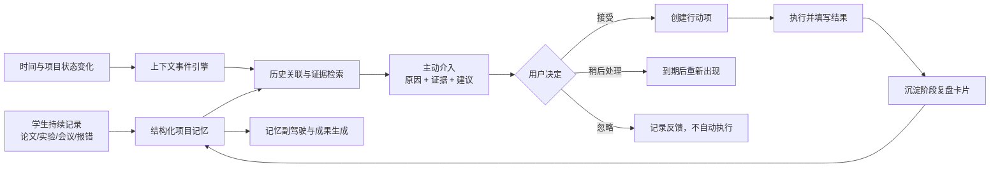
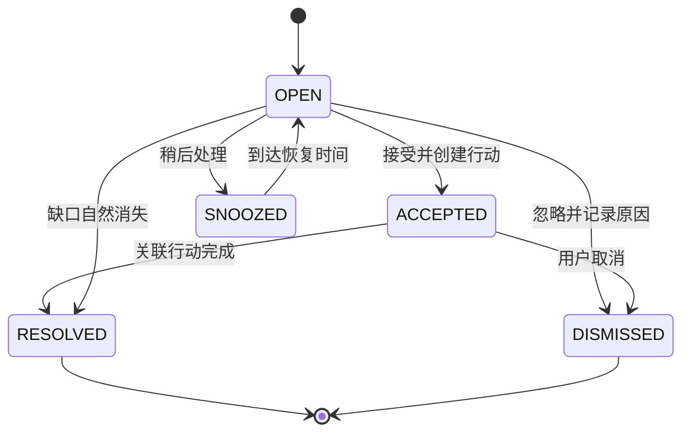
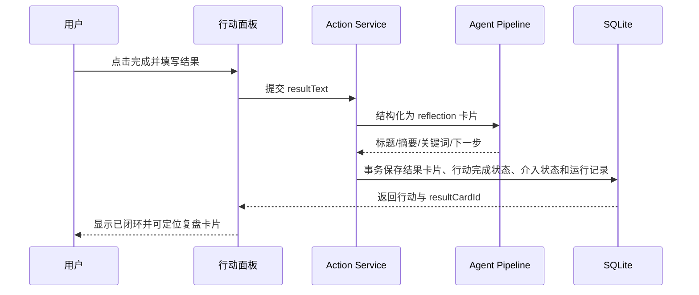
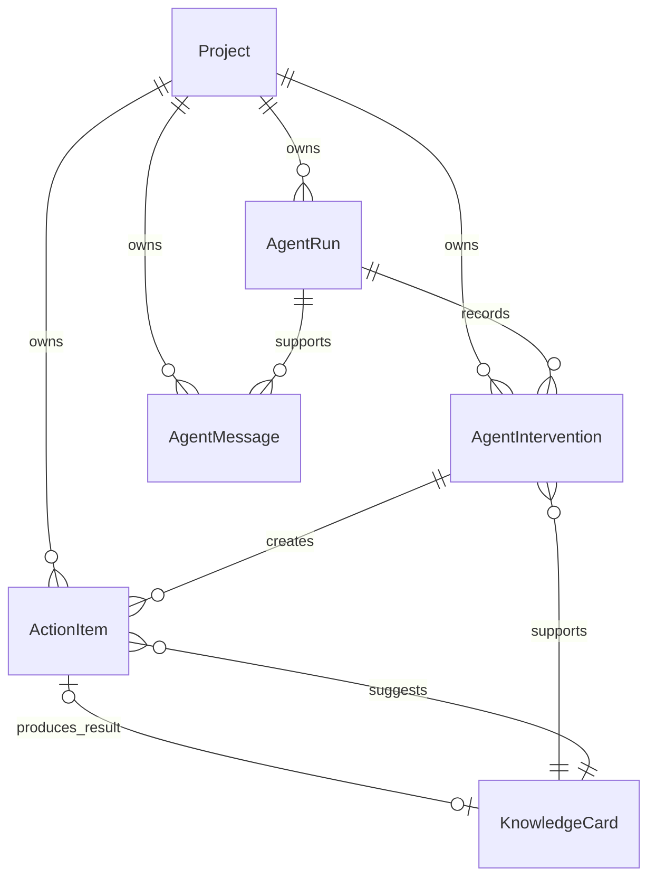
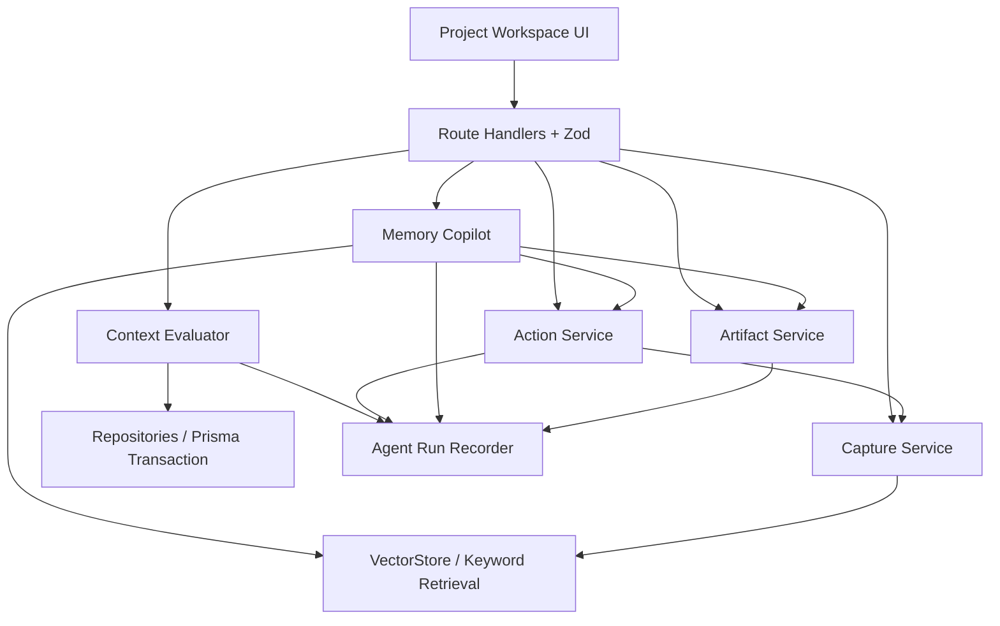

# 忆程 ProjectMemo 竞赛增强与迭代蓝图

> 文档状态：增强已接入代码，等待最终冻结验收  
> 更新日期：2026-07-15  
> 适用目标：2026“中国高校计算机大赛—人工智能创意赛”鸿蒙赛道·Agent 创新方向  
> 状态标记：`已实现`、`第一轮`、`第二轮`、`后续路线`

## 目录

1. [结论先行](#1-结论先行)
2. [当前功能与实测基线](#2-当前功能与实测基线)
3. [赛题要求与评分差距](#3-赛题要求与评分差距)
4. [目标定位与差异化](#4-目标定位与差异化)
5. [目标用户旅程](#5-目标用户旅程)
6. [第一轮：主动 Agent 闭环](#6-第一轮主动-agent-闭环)
7. [第二轮：记忆副驾驶](#7-第二轮记忆副驾驶)
8. [数据模型与接口设计](#8-数据模型与接口设计)
9. [页面与交互设计](#9-页面与交互设计)
10. [可靠性、安全与降级](#10-可靠性安全与降级)
11. [测试与验收](#11-测试与验收)
12. [2026-07-13 至 2026-07-25 冲刺安排](#12-2026-07-13-至-2026-07-25-冲刺安排)
13. [三分钟比赛演示脚本](#13-三分钟比赛演示脚本)
14. [提交材料清单](#14-提交材料清单)
15. [风险、删减与冻结规则](#15-风险删减与冻结规则)
16. [能力状态总表](#16-能力状态总表)
17. [依据与口径](#17-依据与口径)

## 1. 结论先行

忆程 ProjectMemo 当前不是“不能参赛”，而是“基础闭环已经成立，但冲奖辨识度仍需用稳定演示来证明”。现有 Demo 已经完成项目创建、碎片输入、Agent 结构化、知识关联、主动提醒、行动回写和成果生成；作为初赛可演示作品是合格的，但评委仍可能把它理解为“AI 笔记 + 提醒 + 文案生成”的组合。

本轮不以继续堆普通功能为目标，而是把核心体验收敛为一个可验证闭环：

> **项目情境发生变化 → Agent 主动判断 → 给出可追溯依据 → 用户确认行动 → 行动结果回写记忆 → Agent 继续调整。**

产品新定位：

> **忆程 ProjectMemo 是会主动推动项目交付的长期记忆 Agent。**

冲奖增强分为两轮：

- `第一轮`：主动事件引擎、持久化介入、行动闭环、决策依据、效果指标、演示情境模拟器。
- `第二轮`：带知识引用与工具确认的记忆副驾驶。
- `后续路线`：语音、图片、真实后台推送、真实 embedding、知识图谱、鸿蒙客户端和小艺真实发布。

第一轮是比赛叙事成立的最低门槛。若第一轮稳定性门禁没有通过，第二轮不得挤占修复时间。

## 2. 当前功能与实测基线

### 2.1 已实现能力

| 能力 | 当前实现 | 可展示证据 | 状态 |
| --- | --- | --- | --- |
| 项目管理 | 创建、搜索、筛选、排序、编辑、删除、截止日期校验 | `/projects`、`/projects/new`、项目设置面板 | `已实现` |
| 碎片捕获 | 文本输入、来源选择、草稿恢复、快捷提交、长度校验 | 项目详情页捕获编辑器 | `已实现` |
| Agent 结构化 | 分类、标题、摘要、关键词、任务、重要性、下一步 | `lib/agent/` 与 Capture API | `已实现` |
| 模型降级 | OpenAI-compatible 调用；超时、非法 JSON 或异常回退 mock | `LLM_MODE` 配置与测试 | `已实现` |
| 项目记忆 | 关键词交集检索，最多关联 3 张历史卡片 | `VectorStore` 接口与相关资产跳转 | `已实现` |
| 可追溯纠错 | 查看原文、纠正 Agent 结果、删除卡片 | 卡片操作区 | `已实现` |
| 主动提醒 | 风险、任务/复盘、论文/实验、截止日期规则 | 项目详情页 2–4 条提醒 | `已实现` |
| 成果生成 | 周报、作品说明、PPT、README、简历、行动计划 | 成果文档室 | `已实现` |
| 成果版本 | 编辑、保存新版本、复制、Markdown 导出、历史切换 | 成果编辑器 | `已实现` |
| 自动化验证 | Vitest、SQLite 集成测试、Playwright 核心流程 | `tests/`、`e2e/` | `已实现` |

### 2.2 浏览器实测观察

- Landing Page 能在首屏说明“碎片 → 记忆 → 成果”的价值。
- 项目详情能显示主动提醒、捕获框、8 张知识卡片、相关资产和项目概览。
- 当前本地演示库显示 4 份成果；`db:setup` 中的正式 seed 保证 8 条碎片通过 Pipeline 生成卡片，成果历史需要演示操作后生成。
- 成果页能展示已有版本并完成生成、编辑、复制和导出。
- 当前提醒按钮本质上是筛选、跳转或进入成果生成页，并未形成可追踪的行动状态。

### 2.3 “看起来像 AI 笔记”的根因

| 根因 | 当前表现 | 对评审的影响 |
| --- | --- | --- |
| 主动性依赖打开页面 | 页面加载时计算提醒，没有事件生命周期 | 容易被认为是仪表盘提示，不是主动 Agent |
| 建议不能闭环执行 | 点击后跳转，但没有接受、完成和结果回写 | Agent 只会“说”，不会推进工作 |
| 决策过程不可见 | 用户看不到触发条件和引用依据 | Workflow 技术亮点不明显 |
| 缺少作用证据 | 只有卡片、碎片和成果数量 | 无法说明 Agent 是否真的帮助了项目 |
| 自然交互不足 | 主要交互是输入碎片和点击按钮 | 与赛题强调的自然交互仍有距离 |
| 小艺/鸿蒙关联仅在路线图 | 当前没有真实平台接入 | 可以参赛，但不能宣称已完成鸿蒙集成 |

## 3. 赛题要求与评分差距

### 3.1 Agent 创新方向对应关系

| 官方关注点 | 当前证据 | 缺口 | 本轮补强 |
| --- | --- | --- | --- |
| 日常生活与陪伴 | 聚焦大学生项目制学习和竞赛 | 陪伴感偏工具化 | 用持续事件、行动和反馈形成项目陪伴 |
| 主动服务 | 风险与截止日期提醒 | 缺少持久事件、状态和情境证据 | 上下文事件引擎与介入生命周期 |
| 自然交互 | 文本碎片输入 | 缺少问答、解释和自然语言指令 | 带引用和工具调用的记忆副驾驶 |
| Agent 或 Skills | 独立 Agent Pipeline | 工具边界尚未显式化 | 定义稳定工具接口与 Workflow 预留 |
| 框架不限 | Next.js Web Demo 可运行 | 不需要强行重写鸿蒙客户端 | 保留 Web 主体，诚实说明平台路线 |

### 3.2 评分差距矩阵

| 评分项 | 分值 | 当前判断 | 增强后要提供的证据 |
| --- | ---: | --- | --- |
| 创新性 | 50 | 场景合理，但功能组合容易同质化 | 主动事件、可执行行动、反馈记忆、带引用副驾驶 |
| 完备度 | 20 | 基础闭环完整 | 事件到行动再到复盘的完整状态和异常恢复 |
| 前景评估 | 20 | 可扩展到课程、科研和竞赛 | 可复用工具接口、跨场景价值、低部署门槛 |
| 规范性 | 10 | 工程测试较完整，正式材料未完成 | 官方模板、流程图、状态边界、演示与材料清单 |
| 实际应用价值（附加） | 20 | 已有可运行源代码和演示系统 | 稳定离线 Demo、真实项目数据、完整演示视频 |

增强原则：优先提升创新性和完备度，同时用现有可运行 Demo 争取实际应用附加分；不以未经验证的平台接入替代核心产品价值。

## 4. 目标定位与差异化

### 4.1 核心主张

创意描述：

> **将项目碎片转化为会主动推动交付的长期记忆。**

产品叙事：

> 学生不缺信息，缺的是能理解项目进度、保留决策依据，并在正确时刻推动下一步的长期记忆。ProjectMemo 把论文、报错、实验、会议、任务和要求沉淀为结构化项目记忆，在风险、截止日期和信息缺口出现时主动介入，并把行动结果继续写回记忆。

### 4.2 与通用 AI 笔记的区别

| 通用 AI 笔记 | ProjectMemo 目标形态 |
| --- | --- |
| 用户主动输入后生成摘要 | 项目情境变化后可主动产生介入 |
| 内容存储后很少再次使用 | 新输入、提醒、问答和成果都引用历史记忆 |
| 给出建议后流程结束 | 建议可变成行动，完成结果写回复盘卡片 |
| 输出无法解释依据 | 每次介入和回答都展示来源卡片与规则证据 |
| 依赖在线模型才能演示 | mock 与真实模型采用同一接口，失败自动降级 |
| 以聊天为中心 | 以项目交付状态、知识资产和用户确认的工具为中心 |

### 4.3 产品原则

1. **主动但不越权**：Agent 可以发现、解释和建议，产生写操作前必须获得用户确认。
2. **有依据而非装聪明**：展示规则命中、上下文摘要和引用卡片，不展示或伪造模型隐含思维过程。
3. **行动必须可验收**：任务要有状态、结果和回写记录。
4. **演示必须可复现**：无网络、无 API Key、模型超时均可完成核心流程。
5. **状态口径诚实**：模拟情境、目标设计和平台预留必须显式标注。

## 5. 目标用户旅程



用户无需先整理资料，也不需要不断向 Agent 重述背景。项目记忆、事件和行动共同构成可持续更新的上下文。

## 6. 第一轮：主动 Agent 闭环

### 6.1 P0-1 上下文事件引擎

**目标**

把当前页面内即时计算的建议升级为独立、可测试、可复用的 `evaluateProjectContext` 服务。服务读取项目、知识卡片、成果和行动状态，输出介入事件与结构化依据。

**输入上下文**

- 项目截止日期、最近活动时间和项目场景。
- 各类型知识卡片数量、重要性、创建时间与关联状态。
- 未完成行动及其截止时间。
- 已生成成果类型和最近版本时间。
- 可选演示情境；演示输入必须带 `simulated: true`。

**第一轮触发规则**

| 触发类型 | 判断条件 | 证据 | 默认建议 | 去重键 |
| --- | --- | --- | --- | --- |
| `DEADLINE_NEAR` | 距截止日期 ≤14/7/3/1 天或已逾期 | 截止日期、剩余天数、未完成行动 | 生成材料清单、建立彩排行动 | `deadline:{projectId}` |
| `RISK_UNHANDLED` | 存在风险卡且没有关联的开放/完成行动 | 风险卡 ID、摘要、重要性 | 创建规避行动 | `risk:{cardId}` |
| `PROJECT_STALE` | 超过72小时无新记录且仍有开放行动 | 最近活动、开放行动数 | 发起进度复盘 | `stale:{projectId}` |
| `EXPERIMENT_GAP` | 论文笔记≥2且实验记录为0 | 类型计数、相关卡片 | 创建最小验证实验 | `experiment-gap:{projectId}` |
| `MATERIAL_GAP` | 存在材料要求但尚无作品说明/PPT成果 | 要求卡、成果类型 | 生成对应材料或创建准备行动 | `material-gap:{artifactType}` |

同一去重键只保留一个非终态介入。情境加剧时更新严重度和依据，不重复堆叠卡片；证据失效、来源被删除或缺口被补齐时自动标记解决。

**调用时机**

- 项目详情加载时。
- 新增或纠正知识卡片后。
- 创建、完成或取消行动后。
- 生成成果后。
- 演示情境模拟器手动触发时。

第一轮不声称具备操作系统级后台推送。它是事件驱动、请求触发的主动评估服务；后续可由定时任务、日历或小艺 Workflow 调用同一服务。

**失败回退**

- 规则评估完全本地执行，不依赖 LLM。
- 单条规则异常只记录失败步骤，不阻断其他规则。
- 数据库写入失败不返回虚假成功状态。

**测试与演示验收**

- 给定固定时间和数据时输出完全确定。
- 连续评估不会产生重复介入。
- 生成缺失成果后，材料缺口自动解决。
- 演示中选择“截止前48小时”后，3秒内出现带模拟标记、依据和建议的介入卡片。

### 6.2 P0-2 持久化主动介入

**目标**

让提醒具有生命周期，而不是每次刷新重新计算的一段文字。



**交互要求**

- 介入卡片显示严重度、触发原因、产生时间和主要证据。
- “接受”需要预览即将创建的行动，确认后才写入。
- “稍后处理”提供今天稍后、明天、三天后三个选项。
- “忽略”可选填原因，帮助后续统计提醒是否有效。
- 已解决和已忽略事件进入折叠历史，不继续占用首屏。

**验收**

- 状态更新后刷新页面仍保持。
- 过期的稍后处理事件能重新回到开放状态。
- 用户没有确认前不得创建行动或成果。

### 6.3 P0-3 行动闭环

**目标**

让 Agent 的建议变成可执行、可完成、可回写的工作项。

**行动状态**

- `TODO`：已创建，尚未开始。
- `DOING`：用户正在执行。
- `DONE`：已填写完成结果并生成复盘记录。
- `CANCELLED`：用户取消，不计入完成率。

**行动来源**

- 主动介入接受后创建。
- 知识卡片的“下一步建议”转为行动。
- 记忆副驾驶提出并经用户确认后创建。
- 用户在行动面板中手动创建。

**完成流程**



完成结果长度为5–500字。结构化失败时保留行动原状态和用户输入，允许重试；不得出现行动已完成但结果卡片缺失的半完成状态。

**验收**

- 从介入接受到行动创建只产生一条行动。
- 完成行动后生成 `reflection` 卡片并保留来源关系。
- 对应介入自动解决，指标同步更新。
- 事务失败时所有状态回滚。

### 6.4 P0-4 决策依据与 Agent Run

**目标**

让评委看到 ProjectMemo 是受约束的 Workflow，而不是一次普通大模型调用。

每次 Capture、事件评估、成果生成、行动完成和副驾驶问答记录一条 `AgentRun`，最少包含：

- 运行类型和开始时间。
- provider 模式：`mock` 或 `openai-compatible`。
- 执行步骤及成功/失败状态。
- 使用的规则名称、上下文摘要和证据卡片 ID。
- 是否回退、回退原因和总耗时。
- 生成的卡片、介入、行动或成果引用。

页面只展示可验证的结构化依据，例如“命中截止日期≤3天”“引用两张风险卡片”。不展示模型私有推理过程，也不生成看似详细但无法验证的思维链。

**验收**

- 每个主动介入都能打开对应运行记录。
- LLM 超时后显示“已回退本地规则”，核心功能仍成功。
- 删除项目时运行记录级联清理。

### 6.5 P0-5 Agent 效果面板

**目标**

用系统可验证数据说明 Agent 是否促进了项目推进，不编造用户规模或效率提升比例。

| 指标 | 计算方式 | 无样本时 |
| --- | --- | --- |
| 知识关联率 | 有历史前序的卡片中，至少存在一条关系的卡片数 / 可关联卡片数 | 显示“暂无可关联样本” |
| 可追溯率 | 具有原始 Capture 的卡片数 / 卡片总数 | 显示“暂无卡片” |
| 提醒采纳率 | `ACCEPTED + RESOLVED` / 已处理介入数 | 显示“暂无处理记录” |
| 行动完成率 | `DONE` / `TODO + DOING + DONE` | 显示“暂无行动” |
| 闭环沉淀数 | 由完成行动产生的复盘卡片数 | 显示0，不显示百分比 |
| 成果覆盖度 | 已生成成果类型数 / 6 | 显示0/6 |

模拟介入和模拟行动默认不进入真实指标。面板必须能说明口径，并允许查看构成指标的记录。

### 6.6 P0-6 演示情境模拟器

**目标**

在三分钟演示中稳定证明“上下文变化触发 Agent”，同时避免把模拟状态当成真实用户数据。

**预置情境**

1. 截止前48小时：虚拟当前时间推进到截止前两天。
2. 项目停滞72小时：虚拟最近活动时间回退三天，同时保留开放行动。
3. 风险集中：使用正式 seed 中的风险卡片触发未处理风险介入。

**约束**

- 仅在 `DEMO_SCENARIOS=true` 时显示入口。
- 所有模拟介入显示“演示情境”标签并保存 `isSimulated=true`。
- 提供“一键退出并清理模拟数据”。
- 默认统计排除模拟数据。
- 生产描述不得把情境模拟器称为后台推送。

## 7. 第二轮：记忆副驾驶

### 7.1 目标

在项目详情页提供自然语言入口，让用户基于项目记忆询问“现在最危险的是什么”“为什么提醒我准备材料”“本周应该先做什么”，并能在确认后调用项目工具。

### 7.2 支持的意图与工具

| 工具 | 类型 | 行为 | 是否需要确认 |
| --- | --- | --- | --- |
| `search_memory` | 只读 | 检索最多5张相关知识卡片 | 否 |
| `summarize_progress` | 只读 | 汇总进展、任务、风险和缺口 | 否 |
| `explain_intervention` | 只读 | 解释提醒的规则与引用来源 | 否 |
| `create_action` | 写入 | 创建行动项 | 是 |
| `generate_artifact` | 写入 | 调用现有成果生成服务并保存版本 | 是 |

### 7.3 回答契约

```ts
type AgentChatResponse = {
  message: string;
  citations: Array<{
    cardId: string;
    title: string;
    reason: string;
  }>;
  proposedActions: Array<{
    tool: "create_action" | "generate_artifact";
    label: string;
    payload: unknown;
  }>;
  runId: string;
  fallback: boolean;
};
```

- 引用必须来自当前项目，不允许跨项目泄漏。
- 找不到相关记忆时明确说明证据不足，并建议用户补充记录。
- 写操作只能返回待确认动作，不能在聊天生成阶段直接执行。
- 确认动作复用正式 Action/Artifact 服务和校验规则。

### 7.4 Mock 与真实模型

- Mock 使用确定性意图路由和关键词检索，覆盖进展、风险、提醒解释和行动建议。
- 真实模型输出严格 JSON，并通过 Zod 校验。
- 超时、网络错误、空响应、非法 JSON、无引用或越权工具调用全部回退 mock。
- 每次回答加载最多20条最近消息和5张检索卡片，避免上下文无界增长。

### 7.5 交互与验收

- “问 ProjectMemo”打开右侧抽屉；移动端使用全屏面板。
- 引用以可点击卡片显示，点击后关闭抽屉并定位知识卡片。
- 待确认工具以独立卡片显示“将创建什么”，用户确认后才执行。
- E2E 中输入“为什么提醒我准备材料”，回答必须引用材料要求或截止日期依据。
- 输入“帮我创建本周彩排任务”，确认前数据库无变化，确认后只创建一条行动。

## 8. 数据模型与接口设计

### 8.1 新增模型

| 模型 | 核心职责 | 关键数据 |
| --- | --- | --- |
| `AgentIntervention` | 保存主动介入生命周期 | 触发类型、去重键、严重度、证据 JSON、建议动作、状态、稍后时间、模拟标记 |
| `ActionItem` | 保存可执行行动及结果 | 来源介入/卡片、标题、优先级、状态、截止时间、完成结果、结果卡片 |
| `AgentRun` | 保存 Workflow 运行证据 | 运行类型、provider、步骤 JSON、引用、回退原因、耗时 |
| `AgentMessage` | 保存项目级副驾驶对话 | 角色、正文、引用 JSON、候选工具 JSON、关联运行 |



实现约束：

- 所有新模型必须以 `projectId` 隔离并随项目级联删除。
- 介入使用 `projectId + dedupeKey` 唯一约束。
- 行动完成结果卡片使用唯一 `resultCardId`，避免重复提交。
- JSON 字段进入 Repository 前必须通过 Zod 校验。
- 迁移只新增表和可空关系，不破坏当前 Project、Capture、KnowledgeCard、Relation、Artifact 数据。

### 8.2 公共 API

所有接口继续使用现有错误结构：

```ts
type ApiError = {
  error: {
    code: string;
    message: string;
    details?: unknown;
  };
};
```

| 方法 | 路径 | 用途 | 主要校验 |
| --- | --- | --- | --- |
| `POST` | `/api/projects/:id/agent/evaluate` | 正式评估或触发演示情境 | 项目存在、情境枚举、演示开关 |
| `GET` | `/api/projects/:id/interventions` | 获取开放与历史介入 | 项目隔离、分页上限 |
| `PATCH` | `/api/projects/:id/interventions/:interventionId` | 接受、稍后、忽略 | 状态迁移合法、时间合法 |
| `GET` | `/api/projects/:id/actions` | 获取行动面板数据 | 项目隔离、状态筛选 |
| `POST` | `/api/projects/:id/actions` | 用户手动创建行动 | 标题、描述、优先级、日期 |
| `PATCH` | `/api/projects/:id/actions/:actionId` | 开始、完成、取消行动 | 状态迁移、完成结果5–500字 |
| `GET` | `/api/projects/:id/agent/chat` | 获取最近20条项目对话 | 项目隔离 |
| `POST` | `/api/projects/:id/agent/chat` | 提问并返回引用与待确认工具 | 消息1–2000字、工具白名单 |
| `POST` | `/api/projects/:id/agent/tools` | 确认执行副驾驶提出的写操作 | 提案签名、工具白名单、幂等键 |
| `GET` | `/api/projects/:id/agent/runs` | 获取结构化运行证据 | 项目隔离、分页上限 |

现有 Project、Capture、Card 和 Artifact API 保持兼容。内部 `processCapture` 增加可选的来源元数据与首选卡片类型，仅供行动回执等受控服务使用，普通 Capture API 不允许客户端强制伪造 Agent 分类。

### 8.3 服务边界



小艺预留只复用这些服务作为工具，不新建一套业务逻辑。未来工具名称暂定：`capture_fragment`、`search_memory`、`get_interventions`、`create_action`、`generate_artifact`。本轮不提供小艺测试态 Agent，也不写入“已接入小艺”的申报口径。

## 9. 页面与交互设计

### 9.1 项目详情页目标结构

桌面端：

1. 项目档案抬头与主要操作。
2. Agent 效果指标条。
3. 主动介入区：开放事件优先，历史事件折叠。
4. 碎片捕获编辑器。
5. 主内容双栏：知识资产流 + 行动面板/项目概览。
6. 固定但不遮挡内容的“问 ProjectMemo”入口。

移动端顺序：

1. 主动介入。
2. 碎片捕获。
3. 行动面板。
4. 知识资产流。
5. 项目概览。
6. 记忆副驾驶全屏抽屉。

### 9.2 必须覆盖的交互状态

| 组件 | 状态 |
| --- | --- |
| 介入区 | 首次评估、加载、开放、稍后、已接受、已忽略、已解决、评估失败 |
| 行动面板 | 空状态、待办、进行中、完成表单、失败重试、已取消 |
| 决策依据 | 步骤成功、局部失败、LLM 回退、来源卡片已删除 |
| 指标面板 | 有样本、无样本、模拟数据被排除 |
| 情境模拟器 | 未启用、模拟中、模拟已应用、清理完成 |
| 记忆副驾驶 | 空对话、生成中、引用回答、证据不足、待确认工具、执行成功、执行失败 |

所有异步区域使用 `aria-live` 或明确状态文本；危险操作使用确认步骤；键盘焦点在抽屉打开后进入面板，关闭后回到触发按钮；遵守 `prefers-reduced-motion`。

## 10. 可靠性、安全与降级

### 10.1 离线优先

- 事件评估、指标计算、状态流转和工具确认不依赖 LLM。
- Mock 覆盖所有新增 API 和完整 E2E。
- LLM 仅负责增强结构化和自然语言表达，失败不影响数据操作。

### 10.2 幂等与并发

- 介入由唯一去重键保护。
- 接受介入、确认工具和完成行动均带幂等键。
- 重复点击或网络重试不得创建重复行动、成果或结果卡片。
- 状态更新使用事务，并检查当前状态，拒绝非法跳转。

### 10.3 用户控制与隐私

- Agent 不自动提交成果、删除数据或创建写操作。
- 写操作必须显示目标、参数和影响后再确认。
- 引用只能来自当前项目。
- 不在运行记录中保存 API Key、完整系统 Prompt 或不必要的原始隐私内容。
- 决策依据只展示规则、输入摘要和来源，不伪造或暴露模型思维链。

### 10.4 诚实演示

- 模拟情境必须显示“演示情境”。
- Mock 模式继续显示“离线可演示”。
- 未完成的小艺、鸿蒙通知和多模态能力只出现在路线图。
- 指标只计算真实存储记录，不使用预设的虚假提升百分比。

## 11. 测试与验收

### 11.1 单元测试

- 截止日期14/7/3/1天与逾期边界。
- 风险、停滞、实验缺口和材料缺口触发。
- 去重、严重度更新、证据失效自动解决。
- 合法与非法介入/行动状态迁移。
- 指标分母为0、模拟数据排除和正常计算。
- Mock 副驾驶意图分类、引用选择和写工具确认。
- LLM 超时、非法 JSON、无引用和越权工具的回退。

### 11.2 SQLite 集成测试

- 评估服务原子写入 `AgentRun` 与介入。
- 重复评估保持唯一介入。
- 接受介入只创建一条行动。
- 完成行动原子写入结果卡片、关系、行动状态和介入状态。
- 任一步骤失败时事务回滚。
- 项目删除级联清除介入、行动、运行和消息。
- 跨项目读取、更新、引用和工具调用返回404。
- 模拟数据不会进入真实指标。

### 11.3 Playwright 流程

1. 进入 seed 项目，确认当前基础闭环仍可使用。
2. 触发“截止前48小时”演示情境，看到带模拟标记的主动介入。
3. 展开决策依据，确认显示截止时间和相关材料卡片。
4. 接受介入，确认只创建一条行动。
5. 将行动设为进行中并完成，填写结果后定位新复盘卡片。
6. 确认介入已解决、行动完成率更新。
7. 打开记忆副驾驶，询问提醒原因并点击引用卡片。
8. 请求创建行动，确认前无写入，确认后出现行动。
9. 无 API Key、LLM 超时和非法 JSON 均不导致页面崩溃。
10. 390px 视口无横向溢出，抽屉、确认和焦点恢复正常。

### 11.4 最终门禁

```powershell
npm.cmd install
npm.cmd run db:setup
npm.cmd test
npm.cmd run lint
npx.cmd tsc --noEmit
npm.cmd run build
npm.cmd run test:e2e
```

第一轮门禁全部通过后才能进入第二轮；第二轮失败时回退到已经通过门禁的第一轮版本。

## 12. 2026-07-13 至 2026-07-25 冲刺安排

| 日期 | 目标 | 退出条件 |
| --- | --- | --- |
| 7月13日 | 完成增强蓝图与初赛 Markdown 草案 | 两份文档校验通过 |
| 7月14日 | 新模型、迁移、Repository 与 Zod | 数据迁移和集成测试通过 |
| 7月15–16日 | 上下文事件引擎、去重和介入 API | 固定时钟单测与重复评估通过 |
| 7月17日 | 行动面板和完成回写 | 行动闭环 E2E 通过 |
| 7月18日 | Agent Run、决策依据和指标 | 所有介入可追溯，指标口径可解释 |
| 7月19日 | 演示情境模拟器和增强 seed | 三种情境可重复演示且可清理 |
| 7月20日 | 第一轮完整门禁与移动端检查 | 测试、lint、类型、build、E2E 全绿 |
| 7月21–22日 | 记忆副驾驶、引用和工具确认 | 只读与写入确认 E2E 通过 |
| 7月23日 | 第二轮门禁、性能与错误恢复 | 无 API Key/超时/非法 JSON 全部可用 |
| 7月24日 | 更新初赛稿、制作正式设计图和演示脚本 | 功能状态与文档口径一致 |
| 7月25日 | 冻结版本、录制视频、完整彩排 | 可离线连续演示两次无阻塞 |

7月26日只用于官网复核、材料上传和意外缓冲，不安排高风险功能开发。

## 13. 三分钟比赛演示脚本

| 时间 | 演示动作 | 要证明的价值 |
| --- | --- | --- |
| 0:00–0:20 | 首页说明学生项目碎片散落、临近提交反复整理 | 真实需求与明确用户 |
| 0:20–0:45 | 进入 seed 项目，快速展示知识卡片、原文和历史关联 | 长期记忆可追溯 |
| 0:45–1:10 | 启用“截止前48小时”情境，Agent 主动出现 | 上下文触发，不是用户提问后才回答 |
| 1:10–1:30 | 展开决策依据，查看截止日期和材料要求卡片 | Workflow 受约束且有证据 |
| 1:30–1:55 | 接受建议创建彩排行动，完成后填写结果 | Agent 能推动执行 |
| 1:55–2:15 | 展示自动生成的复盘卡片和更新后的效果指标 | 行动结果重新进入长期记忆 |
| 2:15–2:40 | 询问“为什么现在要准备材料”，展示引用和工具建议 | 自然交互且回答有依据 |
| 2:40–2:55 | 生成作品说明或 PPT 新版本 | 记忆主动复用为成果 |
| 2:55–3:00 | 总结小艺 Workflow 预留与后续鸿蒙路线 | 路线清晰但不夸大完成状态 |

演示前固定使用 mock 模式和正式 seed；真实模型只作为可选加分演示，不作为成功路径依赖。

## 14. 提交材料清单

### 14.1 初赛必选

- [ ] 创意描述不超过30字。
- [ ] 设计效果图或交互流程图。
- [ ] 作品介绍不超过800字。
- [ ] 官方作品说明模板已填写团队信息和签名。
- [ ] PDF 主体不超过20页，文件名符合 `01-作品说明文档+团队名称.pdf`。

### 14.2 初赛可选但建议提交

- [ ] 可运行源代码或演示系统压缩包。
- [ ] 3–5分钟演示视频。
- [ ] README、安装说明、mock 模式说明和三分钟演示脚本。
- [ ] 无 API Key 情况下的离线演示检查记录。

### 14.3 复赛提前准备

- [ ] 完整源代码与依赖文件。
- [ ] 5分钟以内视频。
- [ ] 演示 PPT。
- [ ] 一键初始化和故障恢复说明。
- [ ] 若接入小艺，提供真实测试态 Agent；未接入时不得使用相关表述。

## 15. 风险、删减与冻结规则

| 风险 | 预警信号 | 处理策略 |
| --- | --- | --- |
| 新模型导致迁移不稳 | 集成测试出现数据丢失或迁移不可重复 | 停止 UI 开发，先修复迁移与回滚 |
| 主动事件重复刷屏 | 同一项目出现相同开放事件 | 唯一键、幂等测试、合并严重度更新 |
| 行动闭环出现半状态 | 行动完成但没有结果卡片 | 使用单事务并要求结果卡片唯一 |
| 副驾驶退化为通用聊天 | 回答无引用或只给空泛建议 | 无引用即提示证据不足；不返回伪引用 |
| 模拟能力被误解为真实推送 | 页面或材料没有模拟标记 | 强制标签，指标默认排除，文案复核 |
| 第二轮影响第一轮稳定性 | 原有 E2E 或第一轮门禁回归 | 回退第一轮冻结版本，删除第二轮入口 |
| 材料口径超前 | 文档声称功能已接入但代码不可演示 | 使用状态标记，提交前逐项核对 |

功能删减顺序：

1. 先删除副驾驶历史美化和非必要动画。
2. 再缩减副驾驶工具，只保留检索、解释和创建行动。
3. 若仍不稳定，整轮下线副驾驶入口，保留第一轮。
4. 第一轮中不得删除事件去重、用户确认、行动结果回写和 mock 降级。

## 16. 能力状态总表

| 能力 | 状态 | 提交口径 |
| --- | --- | --- |
| 项目、碎片、知识卡片、关系、成果 | `已实现` | 可直接描述和演示 |
| 原文追溯、人工纠错、成果版本 | `已实现` | 可直接描述和演示 |
| 基础风险/截止日期提醒 | `已实现` | 描述为页面内规则提醒 |
| 上下文事件引擎 | `已实现` | 可直接描述和演示，规则证据可查看 |
| 持久化介入与行动闭环 | `已实现` | 可接受提醒、完成回执并生成复盘卡 |
| 决策依据、Agent Run、效果面板 | `已实现` | 展示结构化依据，不展示模型思维链 |
| 演示情境模拟器 | `已实现` | 明确标记为模拟并排除指标 |
| 带引用记忆副驾驶 | `已实现` | mock 离线可用，写工具需确认 |
| 小艺 Workflow 工具接口 | `后续路线` | 描述为接口预留，不是已接入 |
| 语音、图片、鸿蒙通知、客户端 | `后续路线` | 不进入当前功能清单 |

## 17. 依据与口径

本蓝图依据以下本地材料和当前仓库实现形成：

- `2026“中国高校计算机大赛-人工智能创意赛”通知_规程（盖章版）.pdf`
- `2026中国高校计算机大赛人工智能创意赛初赛（鸿蒙赛道）作品说明文档模板.docx`
- 华为开发者文档《智能体编排方式的区别》：<https://developer.huawei.com/consumer/cn/doc/service/differences-in-arrangement-modes-0000002471344117>
- ProjectMemo 当前 Next.js、Prisma、Agent、测试与浏览器实测结果。

当前赛程暂按本地通知中的 **2026-07-26 24:00 初赛报名/提交截止** 规划。通知同时说明赛程变化以官网或赛事群通知为准，因此正式提交前必须再次核对官方渠道。
